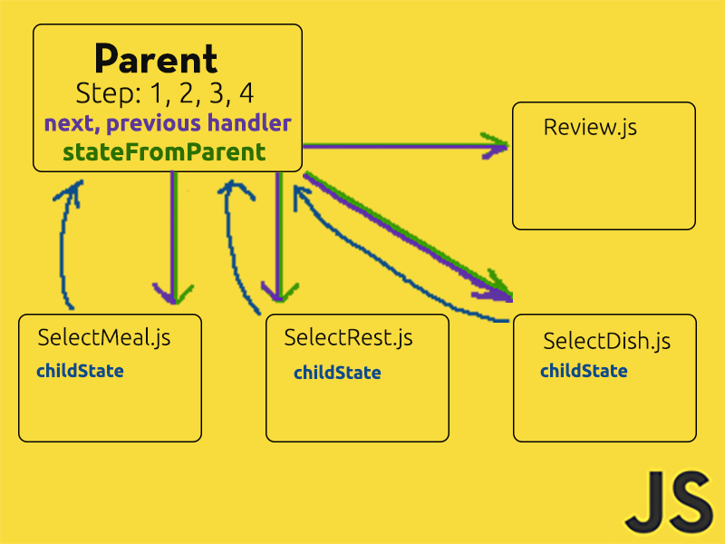

# Multistep Form built using React
Click [here](https://moon004.github.io/multi-step-form/) to view the form. This form does not has a backend and all the collected data will logged into console.

This Form can be used as a template for your own reference.

## For Devs
Clone this project to your local file system.
> git clone https://github.com/moon004/multi-step-form.git

If you are on Linux, just run the build.sh scriptm which will download node and npm package manager for you, and run the script ```npm install && npm start```.

If you are on windows, get your nodejs [here](https://nodejs.org/en/#download). After you finished the installation, run the command below on the root directory of this project (should be at ~/multi-step-form).
>npm install

After it's done getting all the dependencies, start the development server by running:
>npm start

To run the test:
>npm test

Voila! you are good to go.

## The Architecture

This form consist of 4 forms **SelectMeal.js**, **SelectRest.js**, **SelectDish.js**, **Review.js** and they are wrapped inside one parent **App.js**. Each form is served according to the parent's step state. Each and every form's important states will be saved on **parent's state** every time you navigate to the next or previous form. Each and every form's state will be recovered via **parent states** passed down as props namely **stateFromParent**, including the **Review.js** form. The errors generated from the text input box are done by using regex to check the input.

